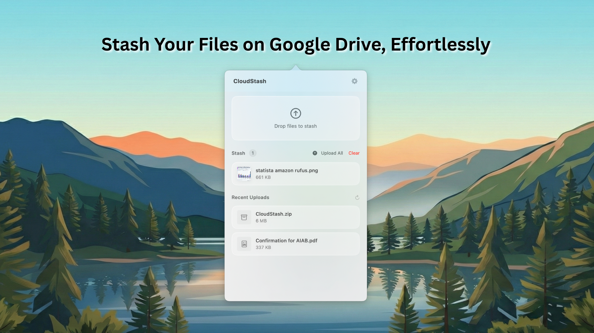

# CloudStash - Stash Files in the Cloud, Effortlessly

A simple macOS menubar app for uploading files to Google Drive with shareable links, plus a floating "shelf" for staging files while you work.

## Features

- **Google Drive Integration** - Sign in with your Google account, files upload to your Drive
- **Drag & drop** files to upload instantly
- **Click to select** files from Finder
- **Floating Shelf** - A mini window that appears when dragging files anywhere on macOS
- **Stage files temporarily** before uploading
- **URLs automatically copied** to clipboard
- **Quick Look preview** for files
- **Download files** directly to your Mac
- **No API keys needed** - Just sign in with Google

## Installation

1. Move `CloudStash.app` to your Applications folder
2. Open the app - it will appear in your menubar

## Setup

1. Click the CloudStash icon in the menubar
2. Click the gear icon to open Settings
3. Click "Sign in with Google"
4. Authorize CloudStash to access your Google Drive
5. You're ready to upload!

## Usage

### Menubar Popover
- **Left-click** the menubar icon to toggle the shelf
- **Right-click** for the context menu (show uploads, settings, quit)
- **Drag & drop** files onto the popover to upload
- **Click** the drop zone to select files from Finder
- **Double-click** a file in the list to preview with Quick Look
- **Hover** over a file to see action buttons (copy URL, download, delete)

### Floating Shelf
- The shelf automatically appears when you drag files anywhere on macOS
- Drop files onto the shelf to stage them temporarily
- Click "Upload All" to upload staged files to Google Drive
- Files under 10MB are copied to a temp folder (safe even if original moves)
- Files over 10MB keep a reference (more efficient for large files)

Uploaded file URLs are automatically copied to your clipboard.

## Requirements

- macOS 14.0 (Sonoma) or later
- Google account

## Building from Source

1. Clone the repository
2. Open `CloudStash.xcodeproj` in Xcode
3. Update the Google OAuth Client ID in `GoogleDriveService.swift`
4. Build and run

### Setting up Google OAuth

1. Go to [Google Cloud Console](https://console.cloud.google.com)
2. Create a new project
3. Enable the Google Drive API
4. Go to Credentials > Create Credentials > OAuth Client ID
5. Select "macOS" as the application type
6. Add the bundle identifier: `aryankeluskar.CloudStash`
7. Copy the Client ID and paste it in `GoogleDriveService.swift`

## License

MIT
